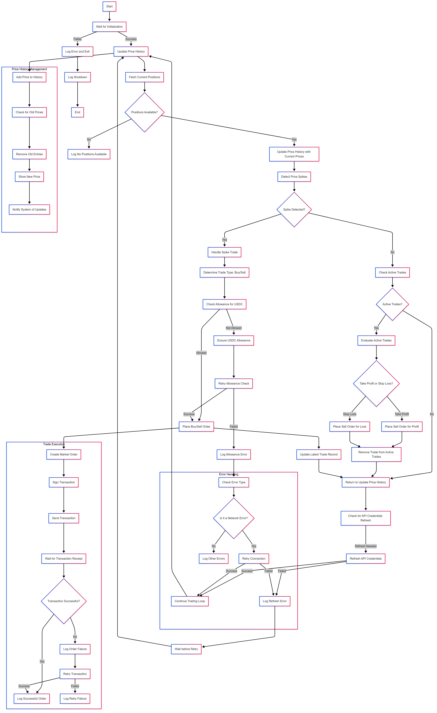

# Automated Trading Bot (Kalshi & Polymarket)

A sophisticated automated trading bot designed for prediction markets (Kalshi currently supported, Polymarket planned). It features a multi-strategy engine, comprehensive risk management, and a high-fidelity backtesting system.

## Features

- **Multi-Platform Support**: Designed for Kalshi (active) and Polymarket (structure in place).
- **Advanced Strategy Engine**:
  - **Spike Strategy**: Detects and trades sudden price movements.
  - **Mispricing Strategy**: Identifies arbitrage and fair-value discrepancies.
- **Robust Risk Management**:
  - 3-Layer Defense: Pre-trade checks, active monitoring, and post-trade analysis.
  - Circuit Breakers: Daily loss limits and account suspension detection.
  - Execution Protection: Slippage monitoring and settlement tracking.
- **High-Fidelity Backtesting**:
  - Parity-aligned engine that reuses live bot components for accurate simulations.
  - Synthetic data generation for stress testing.
- **Paper Trading**: Full simulation mode to test strategies without real capital.

## Setup

1. Install dependencies:
```bash
pip install -r requirements.txt
```

2. Create a `keys.env` file with your configuration:
```env
PK=  \\Replace your private key of metamask
YOUR_PROXY_WALLET=0xAD25B950d4b2FE8e5cD67aAfF8Ea07dc32A7Ba7c  \\Replace your polymarket proxy wallet address.
BOT_TRADER_ADDRESS=0x57e8701477723F013C4a890F00a27c9F4b83e8F6  \\Replace your metamask wallet address
USDC_CONTRACT_ADDRESS=0x2791Bca1f2de4661ED88A30C99A7a9449Aa84174
POLYMARKET_SETTLEMENT_CONTRACT=0x56C79347e95530c01A2FC76E732f9566dA16E113
cooldown=10
take_profit=0.03
stop_loss=-0.025
recent_traded=120
buy_unit_size=3   \\Adjust as you want
```

## Configuration Parameters

- `PK`: Your wallet's private key
- `recent_traded`: Cooldown period between trades (in seconds)
- `cooldown`: Retry cooldown for failed orders (in seconds)
- `take_profit`: Take profit threshold (e.g., 0.03 for 3%)
- `stop_loss`: Stop loss threshold (e.g., -0.025 for -2.5%)

## Bot Structure



1. **State Management**
   - Global variables for tracking trades and prices
   - Price history management
   - Active trade tracking

2. **Trading Logic**
   - Price spike detection
   - Order placement with retries
   - Take-profit and stop-loss management
   - USDC allowance management

3. **Main Loop**
   - Price updates
   - Trade detection
   - Position management
   - API credential refresh

## Running the Bot

```bash
python main.py
```

## Important Notes

- Ensure sufficient USDC balance in your wallet
- Monitor the bot's logs in `bot_log.txt`
- The bot maintains $1 worth of shares when selling
- Trades are executed with a $3 unit size(you can adjust it)
- API credentials are refreshed hourly

## Safety Features

- Automatic retry mechanism for failed orders
- USDC balance checks before trades
- Error handling and logging
- Transaction receipt verification 

## Contact Me

## Directory Layout

```
polymarket-spike-bot-v1/
│
├── test.py                          # Main entry point & orchestration
├── requirements.txt                 # Python dependencies
├── .env                             # Configuration (secrets + parameters)
├── .env.example                     # Template configuration
├── .gitignore                       # Git ignore rules
│
├── logs/
│   └── polymarket_bot.log          # Daily trading activity log
│
├── src/                            # Source code modules (typical structure)
│   ├── __init__.py
│   ├── config.py                   # Load & validate .env config
│   ├── logger.py                   # Logging setup (colorlog)
│   ├── clients/
│   │   ├── __init__.py
│   │   ├── polymarket_client.py    # py-clob-client wrapper
│   │   ├── web3_client.py          # Web3 & contract interactions
│   │   └── kalshi_client.py        # (NEW) Kalshi API wrapper
│   │
│   ├── trading/
│   │   ├── __init__.py
│   │   ├── spike_detector.py       # Price spike identification logic
│   │   ├── order_executor.py       # Order submission & tracking
│   │   ├── position_manager.py     # Trade state management
│   │   ├── fee_calculator.py       # (NEW) Transaction cost calculations
│   │   └── risk_manager.py         # (NEW) Risk monitoring & enforcement
│   │
│   ├── models/
│   │   ├── __init__.py
│   │   ├── order.py                # Order data models
│   │   ├── position.py             # Position tracking models
│   │   ├── market.py               # Market data models
│   │   └── candles.py              # Price history models
│   │
│   ├── utils/
│   │   ├── __init__.py
│   │   ├── decorators.py           # Retry logic, rate limiting
│   │   ├── validators.py           # Input validation
│   │   └── formatters.py           # Output formatting
│   │
│   └── strategies/
│       ├── __init__.py
│       ├── base_strategy.py        # Abstract strategy class
│       └── spike_strategy.py       # Concrete spike detection strategy
│
└── tests/                          # Unit & integration tests
    ├── __init__.py
    ├── test_spike_detection.py
    ├── test_order_execution.py
    └── test_position_manager.py
```